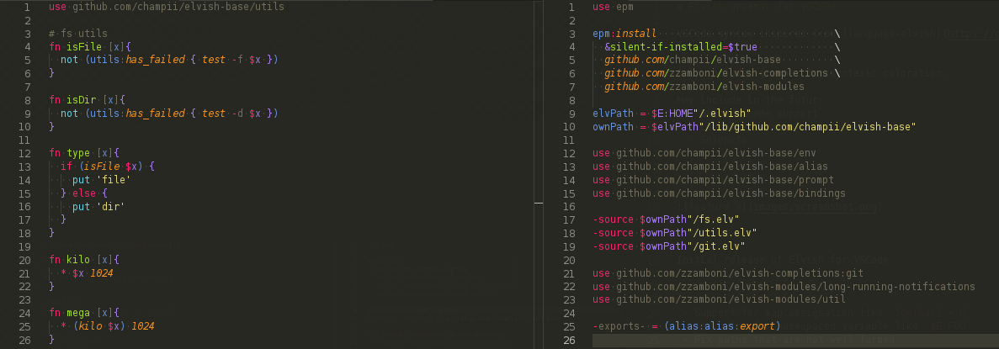

# Elvish grammar for VSCode

VSCode syntax inspired from [language-elvish](https://github.com/iwoloschin/language-elvish) for Atom

Only includes grammar for syntaxic coloration.

May include in the futur:
  - Better theme support
  - Language server for autocompletion
  - Snippets
  - [...]

## Screenshot

### 1.0.0

Initial release of Elvish for VSCode
